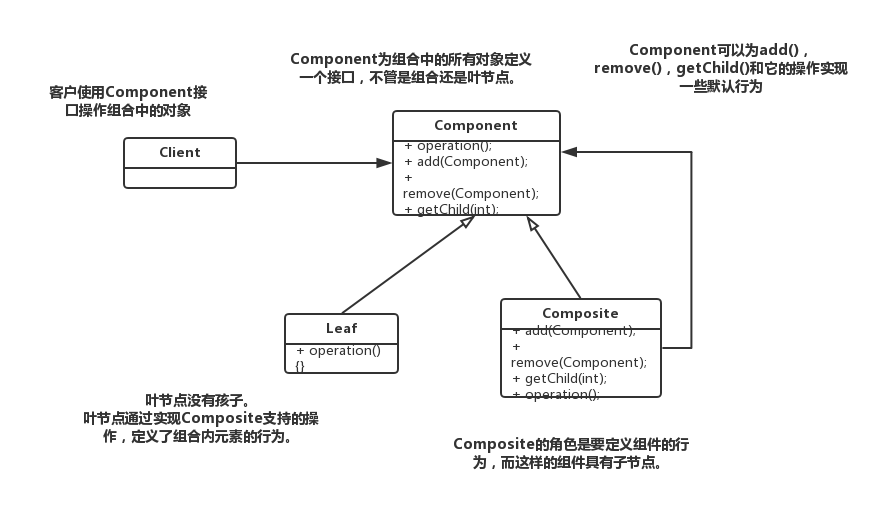

# 主要讲解设计模式

- observer 观察者模式
- strategy 策略模式
- decorate 装饰者模式
- factory 工厂模式
- singleton 单例模式
- command 命令模式
- adapter 适配器模式
- facade 外观模式
- template 模版方法
- iterator 迭代器模式
- composite 组合模式
- state 状态模式
- proxy 代理模式
- compound 复合模式
- [bridge 桥接模式](./docs/Bridge.md)

# 策略模式

> 封装可互换的行为，然后使用委托来决定要采用哪一个行为。

- 找出应用中可能需要变化之处，把它们独立出来，不要和那些不需要变化的代码混在一起。

- 针对接口编程，而不是针对实现编程。

- 多用组合，少用继承。

# 观察者模式

- 为了交互对象之间的松耦合而努力。

# 装饰者模式（不改变接口，但加入责任）

- 类应该对扩展开放，对修改关闭。

# 工厂设计模式
> 提供一个接口，用于创建相关或依赖对象的家族，而不需要明确指定具体类。

- 要依赖抽象，不要依赖具体类。

# 单例模式
> 确保一个类只有一个实例，并提供一个全局访问点。

# 命令模式
> 将“请求”封装成对象，以便使用不同的请求，队列或者日志来参数化其他对象。命令模式也支持可撤销的操作。

- 命令模式类图

- 要点
    1. 命令模式将发出请求的对象和执行请求的对象解耦。
    2. 在被解耦的两者之间是通过命令对象进行沟通的。命令对象封装了接收者和一个或一组动作。
    3. 调用者通过调用命令对象的 `execute` 发出请求，这会使得接收者的动作被调用。
    4. 调用者可以接受命令当做参数，甚至在运行时动态地进行。
    5. 命令可以支持撤销，做法是实现一个 `undo` 方法来回到 `execute` 被执行前的状态。
    6. 宏命令是命令的一种简单的延伸，允许调用多个命令。宏方法也可以支持撤销。
    7. 实际操作时，很常见使用“聪明”命令对象，也就是直接实现了请求，而不是将工作委托给接收者。
    8. 命令也可以用来实现日志和事务系统。
    
# 适配器模式（将一个接口转换成另一个接口）

> 将一个类的接口，转换成客户期望的另一个接口。适配器让原本接口不兼容的类可以合作无间。

# 外观模式（让接口更简单）

> 提供了一个统一的接口，用来访问子系统中的一群接口。外观定义了一个高层接口，让子系统更容易使用。

- 最少知识原则：只和你的密友谈话。

    这个原则希望我们在设计中，不要让太多的类耦合在一起，免得修改系统中一部分，会影响到其他部分。如果许多类之间互相依赖，那么这个系统就会变成一个易碎的系统，它需要花许多成本维护，也会因为太复杂而不易被其他人了解。
    
-  要点
    - 当需要使用一个现有的类而其接口并不符合你的需要时，就使用适配器。
    - 当需要简化并统一一个很大的接口或者一群复杂的接口时，使用外观。
    - 适配器改变接口以符合客户的期望。
    - 外观将客户从一个复杂的子系统中解耦。
    - 实现一个适配器可能需要一番功夫，也可能不费功夫，视目标接口的大小与复杂度而定。
    - 实现一个外观，需要将子系统组合进外观中，然后将工作委托给子系统执行。
    - 适配器模式有两种形式：对象适配器和类适配器。类适配器需要用到多重继承。
    - 你可以为一个子系统实现一个以上的外观。
    - 适配器将一个对象包装起来以改变其接口；装饰者将一个对象包装起来以增加新的行为和责任；而外观将一群对象"包装"起来以简化其接口。
    
# 模版方法

> 在一个方法中定义一个算法的骨架，而将一些步骤延迟到子类中。模版方法使得子类可以在不改变算法结构的情况下，重新定义算法中的某些步骤。

> 好莱坞原则：  
> 别调用（打电话给）我们，我们会调用（打电话给）你。

- 要点
    - "模版方法"定义了算法的步骤，把这些步骤的实现延迟到子类。
    - 模版方法模式为我们提供了一种代码复用的重要技巧。
    - 模版方法的抽象类可以定义具体方法，抽象方法和钩子。
    - 抽象方法由子类实现。
    - 钩子是一种方法，它在抽象类中不做事，或者只做默认的事情，子类可以选择要不要去覆盖它。
    - 为了防止子类改变模版方法中的算法，可以将模版方法声明为 `final`。
    - 好莱坞原则告诉我们，将决策权放在高层模块中，以便决定如何以及何时调用低层模块。
    - 你将在真实世界代码中看到模版方法模式的许多变体，不要期待它们全都是一眼就可以被你认出的。
    - 策略模式和模版方法模式都封装算法，一个用组合，一个用继承。
    - 工厂方法是模版方法的一种特殊版本。

# 迭代器模式

> 提供一种方法顺序访问一个聚合对象中的各个元素，而又不暴露其内部的表示。

- 单一原则
    - 一个类应该只有一个引起变化的原因。
    
    > 类的每个责任都有改变的潜在区域。超过一个责任，意味着超过一个改变的区域。这个原则告诉我们，尽量让每个类保持单一责任。

# 组合模式

> 允许你将对象组合成树形结构来表现“整体/部分”层次结构。组合能让客户以一致的方式处理个别对象以及对象组合。

- 要点
    - 迭代器允许访问聚合的元素，而不需要暴露它的内部结构。
    - 迭代器将遍历聚合的工作封装进一个对象中。
    - 当使用迭代器的时候，我们依赖聚合提供遍历。
    - 迭代器提供了一个通用的接口，让我们遍历聚合的项，当我们编码使用聚合的项时，就可以使用多态机制。
    - 我们应该努力让一个类只分配一个责任。
    - 组合模式提供一个结构，可同时包容个别对象的组合对象。
    - 组合模式允许客户对个别对象以及组合对象一视同仁。
    - 组合结构内的任意对象称为组件，组件可以是组合，也可以是叶节点。
    - 在实现组合模式时，有许多设计上的折衷。你要根据需要平衡透明性和安全性。
    
# 状态模式

> 允许对象在内部状态改变时改变它的行为，对象看起来好像修改了它的类。

- 要点
    - 状态模式允许一个对象基于内部状态而拥有不同的行为。
    - 和程序状态机不同，状态模式用类代表状态。
    - Context会将行为委托给当前对象。
    - 通过将每个状态封装进一个类，我们把以后需要做的任何改变局部化了。
    - 状态模式和策略模式有相同的类图，但是它们的意图不同。
    - 策略模式通常会用行为或算法来配置Context类。
    - 状态模式允许Context随着状态的改变而改变行为。
    - 状态转换可以由State类或Context类控制。
    - 使用状态模式通常会导致设计中类的数目大量增加。
    - 状态类可以被多个Context实例共享。
    
# 代理模式

> 为另一个对象提供一个替身或占位符以控制对这个对象的访问。

- 要点
    - 代理模式为另一个对象提供代表，以便控制客户对对象的访问，管理访问的方式有许多种。
    - 远程代理管理客户和远程对象之间的交互。
    - 虚拟代理控制访问实例化开销大的对象。
    - 保护代理基于调用者控制对对象方法的访问。
    - 代理模式有许多变体，例如：缓存代理，同步代理，防火墙代理和写入时复制代理等。
    - 代理在结构上类型装饰者，但是目的不同。
    - 装饰者模式为对象加上行为，而代理则是控制访问。
    - java内置的代理支持，可以根据需要建立动态代理，并将所有调用分配到所选的处理器。
    - 就和其他的包装者一样，代理会造成你的设计中类的数目增加。
    
# 复合模式

> 复合模式在一个解决方案中结合两个或多个模式，以解决一般或重复发生的问题。

- 要点
    - MVC是复合模式，结合了观察者模式，策略模式和组合模式。
    - 模型使用观察者模式，以便观察者更新，同时保持两者之间解耦。
    - 控制器是视图的策略，视图可以使用不同的控制器实现，得到不同的行为。
    - 视图使用组合模式实现用户界面，用户界面通常组合了嵌套的组件，像面板，框架和按钮。
    - 这些模式携手合作，把MVC模型的三层解耦，这样可以保持设计干净又有弹性。
    - 适配器模式用来将新的模型适配成已有的视图和控制器。
    - Model2是MVC在Web上的应用。
    - 在Model2中，控制器实现成Servlet，而JSP/HTML实现视图。
    
# 模式分类
    
- 创建型

    > 创建型模式涉及到将对象实例化，这类模式都提供一个方法，将客户从所需要实例化的对象中解耦。
    
    - 单例模式（Singleton）
    - 抽象工厂（Abstract Method）
    - 工厂方法（Factory Method）

- 行为型
    
    > 行为型都涉及到类和对象如何交互分配职责。
    
    - 模版方法（Template Method）
    - 迭代器模式（Iterator）
    - 命令模式（Command）
    - 观察者模式（Observer）
    - 状态模式（State）
    - 策略模式（Strategy）

- 结构型

    > 结构型模式可以让你把类或对象组合到更大的结构中。
    
    - 装饰者模式（Decorator）
    - 代理模式（Proxy）
    - 组合模式（Composite）
    - 外观模式（Facade）
    - 适配器模式（Adapter）
    - 桥接模式（Bridge）

# 使用设计模式时注意的要点

- 让设计模式自然而然的出现在你的设计中，而不是为了使用而使用。
- 设计模式并非僵化的教条；你可以依据自己的需要采用或调整。
- 总是使用满足需要的最简单解决方案，不管它用不用模式。
- 学习设计模式的类目，可以帮助你自己熟悉这些模式以及它们之间的关系。
- 模式的分类（或类目）是将模式分成不同的族群，如果这么做对你有帮助，就采用吧！
- 你必须相当专注才能够成为一个模式的专家：这需要时间也需要耐心，同时还必须乐意做大量的精化工作。
- 请牢记：你所遇到大多数的模式都是现有模式的变体，而非新的模式。
- 模式能够为你带来的最大好处之一是：让你的团队拥有共享词汇。